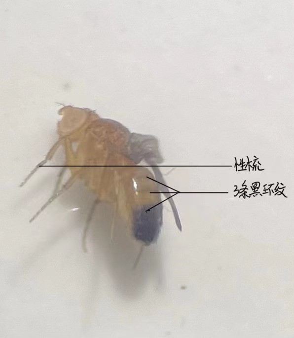

# 
 **果蝇的雌雄鉴别和原种培养**

 生物信息学班	李泽华	320210928501 

 Abstract 

 Drosophila melanogaster, commonly known as the fruit fly, is a widely used model organism in biological research. Distinguishing between male and female fruit flies and maintaining wild-type strains are crucial for many laboratory experiments. This article will introduce methods for distinguishing between male and female fruit flies and for maintaining wild-type strains. Male and female fruit fly differentiation is typically done during the adult stage, based on the distinct sexual characteristics of fruit flies at this stage. To maintain and breed a specific population of fruit flies in the laboratory, we conducted primary cultures of wild-type and three-eyed fruit flies. 

 摘要 

 果蝇（Drosophila melanogaster）是生物学研究中广泛应用的模式生物，研究果蝇的雌雄鉴别和原种培养对于许多实验室至关重要。本文将介绍果蝇的雌雄鉴别方法以及原种培养方法。果蝇的雌雄鉴别通常在成虫阶段进行，我们将根据果蝇成虫阶段的不同性别特征对果蝇进行雌雄鉴别。为了在实验室维护并繁殖一种特定的果蝇群体，我们对野生型和三隐果蝇进行了原代培养。

### 1. 前言

​	果蝇是双翅目果蝇属的昆虫，作为生物学研究的模式生物，几十年来一直吸引着科学家。其相对简单的基因组、较短的寿命和较高的繁殖速度，使得果蝇成为了科学家研究基因组学、遗传学、发育生物学等众多领域的理想对象。通过深入了解果蝇的具体性状，我们将能够更好地利用果蝇模式生物，进一步探索生命科学的奥秘，推动科学知识的不断进步。

### 2. 实验材料

* 2.1 材料
  
  * 黑腹果蝇野生型及不同突变品系

  

* 2.2 试剂
  * 乙醚、乙醇、水、琼脂、蔗糖、玉米粉、酵母粉、丙酸

  * 果蝇培养基（玉米粉培养基或玉米红糖培养基）

* 2.3 器具
  * 恒温培养箱、双目解剖镜、高压灭菌锅、白瓷板、镊子、毛笔、解剖针、无菌麻醉瓶、无菌果蝇培养瓶(三角瓶和平底试管)、死蝇盛留器、海绵垫、脱脂棉、医用纱布、标签纸、牛皮纸、棉线绳、橡皮筋、酒精灯等。

### 3. 实验原理

* 3.1 果蝇及其生活史
  
  * 果蝇(fruit fly): 
  
    双翅目（Diptera）果蝇属（*genus Drosophila*）昆虫，全世界已记载的种类约有3000名种，我国己发现800多种。大部分的物种以腐烂的水果或植物体为食，少部分则只取用真菌、树液或花粉为其食物。果蝇的遗传学研究广泛而深人，尤其在基因分离、连锁互换等方面十分突出，为遗传学的发展做出了突出贡献。直至今日，果蝇仍然是遗传学、细胞生物学、分子生物学以及发育生物学等研究中常用的模式动物之一。
  
    通常用作遗传学实验材料的是黑腹果蝇（Drosophila melanogaster）。用果蝇作力实验材料有许多优点：
  
    > （1）饲养容易。以玉米粉等做饲料就可以生长、繁殖。
    > （2）生长迅速。在常温下，十二天左右就可完成一个世代，每个受精的雌蝇可产卵400~500个，因此在短时间内就可获得大量的子代，便于遗传学分析。
    > （3）染色体数少。只有4对。
    > （4）唾腺染色体制作容易。横纹清晰，是细胞学观察的好材料。
    > （5）突变性状多，而且多数是形态突变，便于观察。
    > （6）基因组测序已于2000年完成。
  
  * 果蝇的生活史:
  
    果蝇为完全变态类昆虫，其生活史包括卵、幼虫、蛹、成虫四个连续的发育阶段：
  
    * (1) 卵：成熟的雌蝇交尾后2天将卵产在培养基的表层。果蝇的卵为白色，长椭圆形，长约0.5 mm，在背面的前端伸出一对触丝，它能使卵附着在柔软的食物上，不至于深陷到食物中去。
  
    * (2) 幼虫：幼虫从卵中孵化出来后，经过两次蜕皮发育成3龄幼电，体长可达4~5 mm。在解剖镜下观察可见一端稍尖为头部，并且有一黑点即口器；稍后有一对半透明的唾腺，每条唾腺前有一条唾腺管向前延伸，然后会合成一条导管通向消化道。神经节位于消化道前端的上方。
  
    * (3) 蛹：幼虫生活4~5天左右即化
      蛹，化蛹前从培养基中爬出附在瓶壁上，渐次形成一个梭形的蛹。起初颜色淡黄、柔软，以后逐渐硬化，变为深褐色，这就显示即将羽化了。
  
    * (4) 成虫：刚羽化出的果蝇，身体狭长，翅还没有展开，身体较白嫩，通过腹部体壁，可以看到黑色的消化系统。不久，蝇体变为粗短椭圆形，双翅展开，体色加深。果蝇羽化10～12h后才开始交配，成体果蝇在25°C条件下可存活1个月左右。(实际上，果蝇的生活史长短与温度有密切关系。一般来说，30°以上温度能使果蝇不育或死亡，低温能使生活史延长，生活力下降，饲养果蝇的最适温度为20~25°C。)
  
* 3.2 果蝇成体的外部形态

  果蝇成体分为头、胸和酸3个部分。头部的前端钝而平，有1对大的红色复眼、3个单眼和］对触角，触角芒星羽毛状。胸部有3对足、1对翅膀和1对平衡棒。腹部背面为有色素带的背板，腹面有腹板。外生殖器位于腹部未端。

* 3.3 果蝇的雌雄鉴别

  能够准确而迅速地辨认果蝇性别，是果蝇杂交中挑送处女蝇的必要条件。果蝇的雌雄性别在幼虫期较难区别，但是到了成虫期区别相当容易。其特点如下：

  > （1）体型：雌果蛹体型较大，雄果蛹体型较小。
  >
  > （2）腹部未端：雌性腹部椭圆，末端稍尖，雄性末端钝圆。
  >
  > （3）腹部背面：雌性有明显的5条黑色环纹，雄性只有3条，前两条细，后一条宽，延至腹面，肉眼看其腹部末端呈现一明显黑斑。
  >
  > （4） 腹部腹面：雌性有较明显的6个腹片，雄性有4个腹片。
  >
  > （5）性梳：雄性第一对足的跗节基部外侧有黑色毛状性梳（Sex combs），雌性则无。性梳的有无，是鉴别果蝇雌雄性别的明显标志之一

* 3.4 果蝇常见的突变类型

  野生型果蝇为灰体、红眼、长翅、直刚毛。本实验中选用的果蝇突变性状一般都可用肉眼鉴定，例如黑体、白眼、残翅等。而另一些性状可在解剖镜下鉴定，如焦刚毛等。果蝇一些常见的突变性状及其相关基因列表如下。

| 影响部位 | 突变性状 | 基因符号 | 性状特征          | 染色体座位 |
| -------- | -------- | -------- | ----------------- | ---------- |
| 体色     | 黑檀体   | e      | 黑檀色, 更深     | III - 70.7 |
|          | 黑体     | b      | 乌木色, 黑亮     | II - 48.5 |
|          | 黄体     | y      | 浅橙黄色体色     | X - 0.0 |
| 复眼     | 白眼     | w      | 白色眼睛          | X - 1.5 |
|          | 褐眼     | bw    | 棕色眼睛          | II - 104.5 |
|          | 猩红眼   | st   | 猩红色眼睛        | III - 44.0 |
|          | 棒眼     | B    | 眼睛像棒子般形状 | X - 57.0 |
| 翅形     | 残翅     | vg     | 翅膀不完全展开    | II - 67.0 |
|          | 小翅     | m    | 小翅膀            | X - 36.1 |
|          | 卷翅     | Cy   | 翅膀卷曲          | II - 6.1 |
|          | 展翅     | D    | 翅膀展开正常      | III - 40.7 |
| 刚毛     | 焦刚毛   | sn3 | 刚毛变短, 凹陷   | X - 21.0 |
|          | 叉毛     | f    | 刚毛分叉          | X - 56.7 |

### 4. 实验方法

* 4.1 果蝇培养基的配置
  * 果蝇是以酵母菌作为主要食料的，因此实验室内凡能发酵的基质，都可用作果蝇的饲料。本次实验用到的培养基是玉米红糖培养基。
  * 制作方法: 按配方称量各种成分后取应加水量的一半，加入琼脂，煮沸，使充分溶解，加糖，煮沸溶解；取另一半水混合玉米粉，加热，调成糊状。将上述两者混合煮沸。以上操作过程中要持续搅拌，以免沉积物烧焦。待稍冷后加入酵母粉及丙酸，充分调匀，分装。丙酸的作用是抑制霉菌污染，用量为6mL/L。如无酵母粉，也可用酵母菌液代替，但用法不同。酵母菌液在饲料分装到培养瓶中后再加入，每瓶加数滴。

图一 玉米红糖培养基配方

* 4.2 果蝇遗传性状的观察

  * 肉眼观察：先用肉眼观察瓶内不同发育阶段果蝇的形态。

  * 果蝇麻醉：对果蝇进行检查时，常用乙醚麻醉，使果蝇处于昏迷状态。先将生长果蝇的培养瓶在海绵垫上轻轻磕，使果蝇全部震落在培养瓶底部，然后迅速打开培养瓶的棉塞，把果蝇倒入去盖的麻醉瓶(灭菌的平底试管)中，并立即塞上棉塞。然后将乙醚(1滴)滴到脱脂棉上，从麻醉瓶塞侧面塞入麻醉瓶中(注意不要让乙醚流进瓶内)，麻醉瓶要保持干燥，否则会粘住果蝇翅膀，影响观察。待果蝇全部昏迷后，倒在白瓷板上观察。

    > 注意: 果蝇的麻醉程度依实验要求而定，对仍需培养的果蝇，以轻度麻醉为宜。但对不再需要培养，只进行性状观察的果蝇可以深度麻醉，甚至致死(果蝇翅膀外展45°角，说明死亡)。检查完毕，把不需要的果蝇倒入盛有煤油或乙醇或水的死蝇盛留器中。

  * 显微观察：将麻醉状态下的果蝇倒在白瓷板上，放到双目解剖镜下观察。

* 4.3 原种培养

  * 在做新的留种培养时，应事先检查一下果蝇有没有混杂，以防原种丢失。亲本的数目一般每瓶5～10对（至少要保证有10只雌果蝇），移入新瓶时，须将已灭菌的培养瓶横卧，然后将果蝇培养瓶打开，让果蝇进入新的培养瓶中。原种每2～4周换一次培养基(依温度而定，10～15℃约4周换一次，20～25℃约2周换一次)。每一原种培养至少保留2套，培养瓶的标签上要写明突变名称、培养日期筹。原种培养的温度可控制在10～15℃，培养时避免日光直射。

  * 果蝇在适宜条件下会产生子代，在肉眼能看到幼虫时就可把亲本倒掉，再继续培养几天后，新的成蝇就羽化了。待成蝇有了足够保种的数量后，要调换培养瓶，将它们作为下一代的亲本，继续培养。

  > 原种果蝇培养过程中常会遭遇饲料发霉。发霉的原因很多，如用具没有彻底灭菌、空气污染、亲本不及时倒掉等。严重的霉菌污染会影响果蝇的生长。饲料中加丙酸可以抑制霉菌生长，但并不能完全防止。发现培养瓶中有少量霉点时可用烧过的解剖针挑出。若大量霉菌污染，可把果蝇全部倒入一个无菌的空平底试管中，让它活动2～3 h，再换一支试管，再活动1～2h，而后倒入一支新的培养瓶中继续培养，这样可以防止霉菌扩散。
  >
  > 原种保存遇到的另一个问题是混杂。几个不同品系的果蝇在一起培养，一定要防止混杂。培养瓶的塞子要做得紧些，不使果蝇逃出。调换培养瓶时，要防止果蝇飞散。外逃的果蝇要杀死。发现了混杂的原种，要根据原种果蝇的全部特征，挑出数对雌雄蝇饲养，进行筛选，直到完全没有性状分离为止。这样做，费时费力，是在不得已时才采用。一般混杂时，只要方便，可以重新引种，将混杂种弃去。

### 5. 实验结果

* 5.1 果蝇雌雄鉴别

  三隐: 

  * 雌

    

  * 雄

    

  黑体: 

  * 雌

    

  * 雄

    

* 5.2 果蝇原种培养

  培养结果: 

  

### 6. 参考文献

1. 刘祖洞，江绍慧. *遗传学实验* (2版). 北京：高等教育出版社，1987.

2. 王金发，戚康标，何炎明. *遗传学实验教程*. 北京：高等教育出版社，2008.

3. 周洲，程罗根. *遗传学实验*. 北京：科学出版社，2013.

4. 朱睦元，王君晖. *现代遗传学实验*. 杭州：浙江大学出版社，2009.

5. 乔守怡. *遗传学分析实验教程*. 北京：高等教育出版社，2008.

6. 张文霞，戴灼华. *遗传学实验指导*. 北京：高等教育出版社，2007.

7. 牛炳韬, 孙英莉. *遗传学实验教程 (第二版)*. 兰州: 兰州大学出版社，2018.
